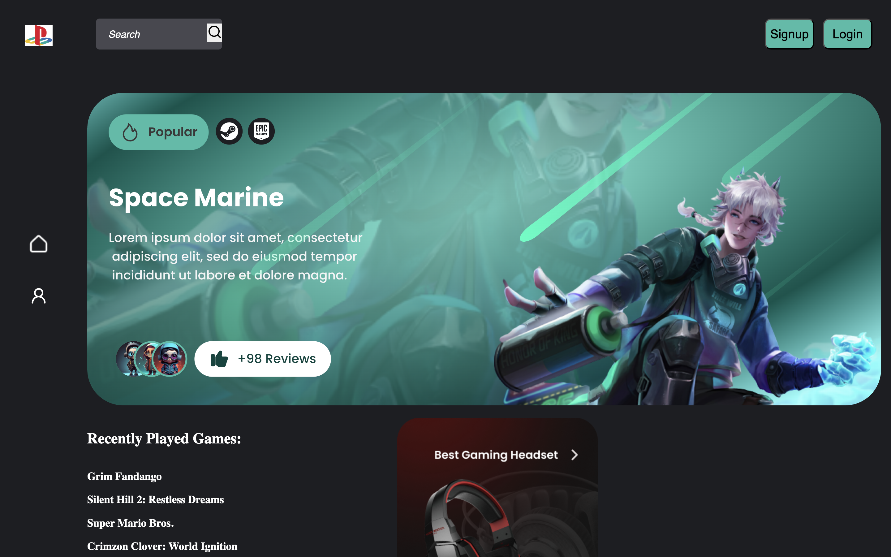
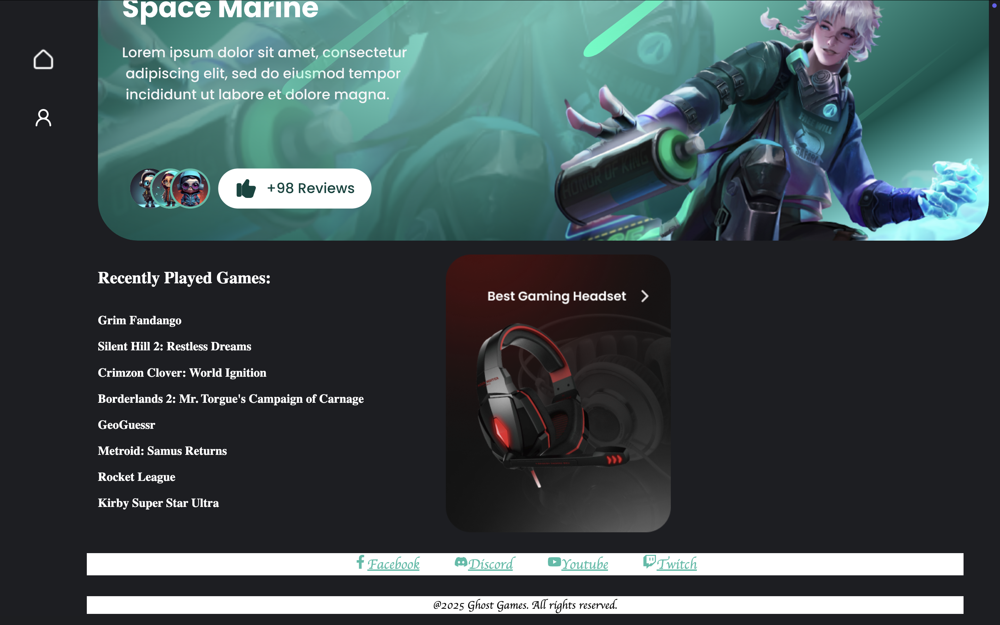
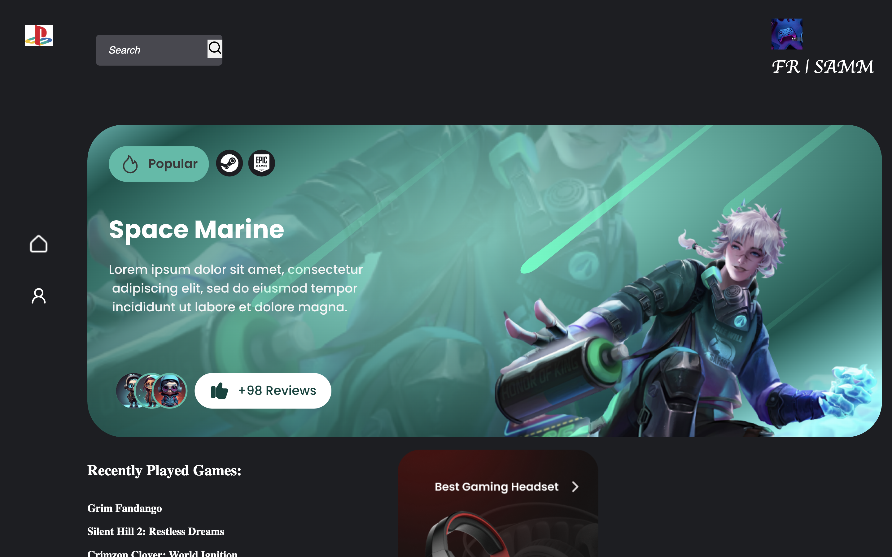
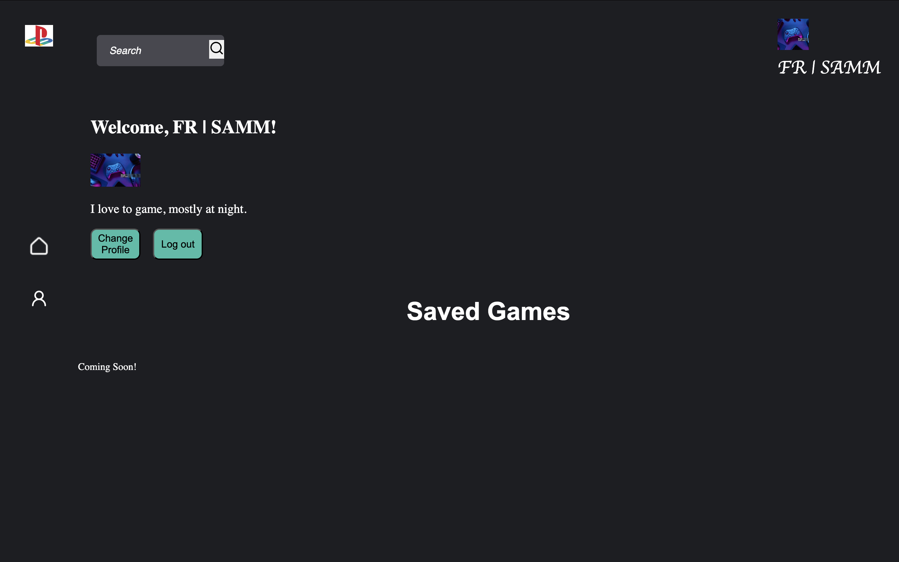

# Ghost Gaming UI Frontend : Final Custom Project

This is the frontend for the Ghost Gaming platform, built with React and Vite. It includes various features, such as user Authentication, protected routes via JWT, and a responsive UI for browsing and interacting with game data through a custom-built backend.

## Table of Contents

- [Project Description](#project-description)
- [Project Features](#project-features)
- [Technologies Used](#technologies-used)
- [Plan for Improving the Project](#plan-for-improving-the-project)
- [Backend Implementation](#backend-implementation)
- [Screenshots](#screenshots)
- [Live Demo](#live-demo)
- [Deployment Instructions](#deployment-instructions)
- [System Requirements](#system-requirements)
- [Domain Name](#domain-name)

## Project Description

- This is the frontend for the Ghost Gaming platform, featuring:

* User Authentication
* Game searching and getting games functionality with IGDB API
* A custom-built backend

## Project Features

### Currently Implemented:

- User registration and login with JWT authentication
- Browse and search games using IGDB API
- Responsive design for desktop and mobile
- Protected routes for authenticated users
- User profile management

### Coming Soon:

- Save/unsave games functionality
- Mobile toggle menu
- Advanced search filters
- Social sharing features

## Technologies Used

- React.js with Vite
- React Router for navigation
- CSS3 for responsive design
- JWT for authentication
- IGDB API integration

## Plan for Improving the Project

- Implement the "coming soon" feature: allowing users to save and unsave games from search results using React hooks and backend API endpoints.

- Improve mobile responsiveness to better include a toggle menu for the header for a better UI experience on smaller screen sizes.

- Expand search functionality with filters, and integrate social sharing features so users can share games or achievements with friends/family.

## Backend Implementation (Stage 2)

- Backend API URL: https://api.ghost-app.jumpingcrab.com
- Backend repository: [https://github.com/Samjamhas10/ghost-gaming-backend.git]

- User authentication
- CORS configured for cross-origin requests

## Screenshots

## Ghost Homepage



## Ghost Main/Footer



## Logged In 



## Profile Section



## Live Demo

- https://ghost-app.jumpingcrab.com/
- coming soon ..

## Deployment Instructions

- To run the frontend locally:

1. Clone the repository:

   ```bash
   git clone https://github.com/samjamhas10/ghost-gaming-frontend.git
   ```

2. Navigate to project directory:

   `cd ghost-gaming-frontend`

3. Install dependencies

   `npm install`

4. Launch the server

   `npm run dev`

## System Requirements

- Node.js: v23.11.0 or higher
- npm: v10.9.2 or higher
- Modern web browser (Chrome, FireFox, Safari)

## Domain Name

- Frontend + Backend: https://ghost-app.jumpingcrab.com/
- API Base URL: https://api.ghost-app.jumpingcrab.com/
